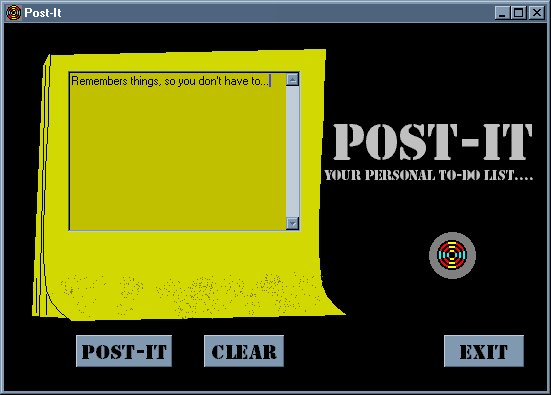



## Post\-It \(registry example\)

### Description

This code stores the text that the user enters into the windows registry. When the form loads, if it has be posted, the message will come up. It also shows how to clear the registry in your section. Please check it out and vote!!!
 
### More Info
 

             |
---                |---
**Submitted On**   |2000-09-15 22:25:58
**By**             |[spyrul](https://github.com/Planet-Source-Code/PSCIndex/blob/master/ByAuthor/spyrul.md)
**Level**          |Intermediate
**User Rating**    |3.8 (15 globes from 4 users)
**Compatibility**  |VB 6\.0
**Category**       |[Registry](https://github.com/Planet-Source-Code/PSCIndex/blob/master/ByCategory/registry__1-36.md)
**World**          |[Visual Basic](https://github.com/Planet-Source-Code/PSCIndex/blob/master/ByWorld/visual-basic.md)
**Archive File**   |[CODE\_UPLOAD99219152000\.zip](https://github.com/Planet-Source-Code/spyrul-post-it-registry-example__1-11501/archive/master.zip)

### API Declarations

D/L the code and VOTE!!!

